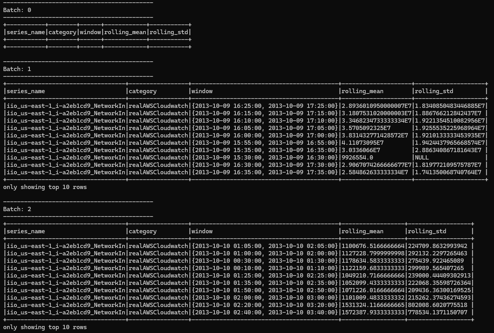
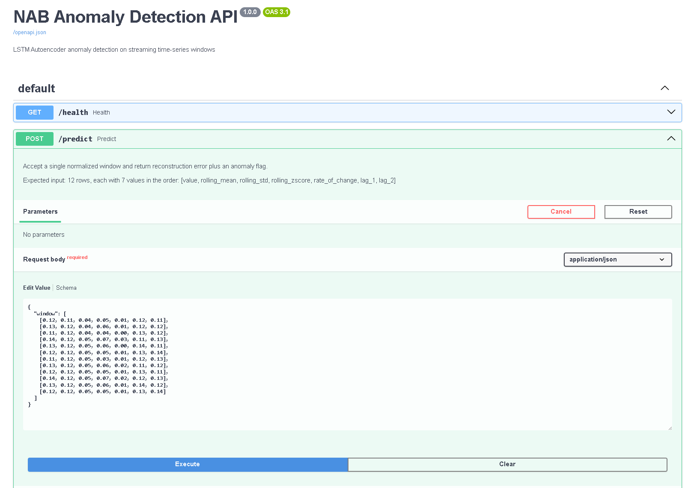
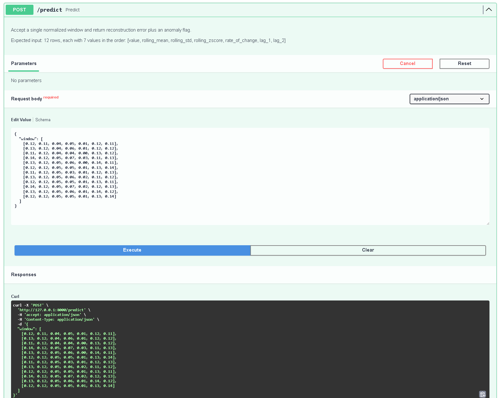
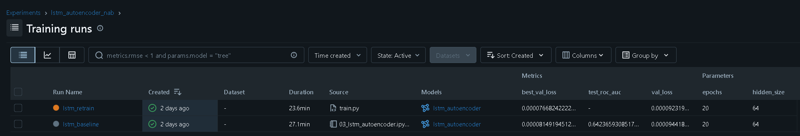
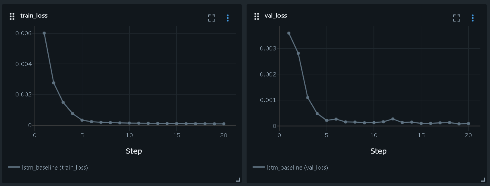
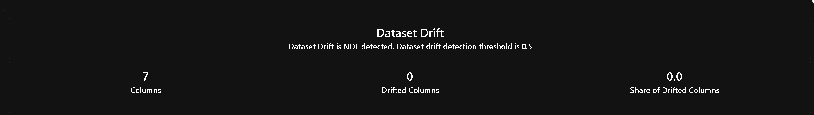
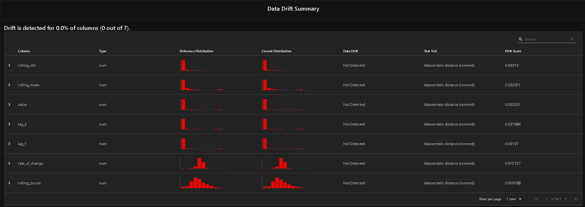
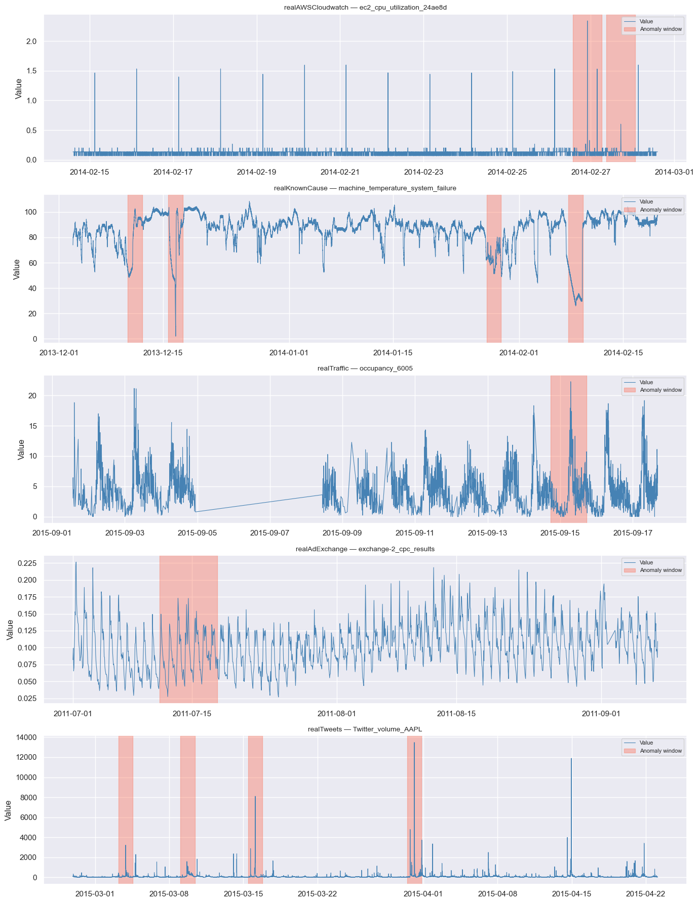
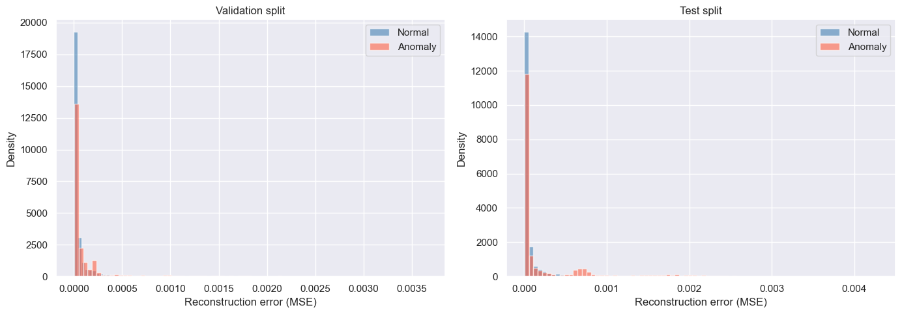

# Real-Time Anomaly Detection MLOps Pipeline

End-to-end streaming ML pipeline demonstrating production MLOps infrastructure:
Kafka ingestion → Spark feature engineering → LSTM autoencoder training →
FastAPI model serving → Airflow orchestration → Evidently AI drift monitoring.

---

## Demo

### Kafka → Spark Structured Streaming (live batches)


### FastAPI /predict endpoint (Swagger UI)


### Live prediction response


### MLflow experiment tracking (2 runs)


### LSTM loss curves (20 epochs)


### Evidently AI drift monitoring



### NAB time series with anomaly windows


### Reconstruction error distributions (normal vs anomaly)


---

## Architecture

```
NAB Dataset (58 time-series files)
        ↓
Apache Kafka — NAB replay producer · Confluent Cloud
        ↓
Spark Structured Streaming — sliding windows · rolling features
        ↓
DuckDB + dbt — feature store · batch transforms · schema tests
        ↓
┌─────────────────────┐     ┌─────────────────────┐
│ PyTorch LSTM        │     │ FastAPI + Docker     │
│ Autoencoder         │     │ /predict endpoint    │
│ MLflow tracking     │     │ anomaly flag + score │
└─────────────────────┘     └─────────────────────┘
        ↓                           ↓
        └──────── Apache Airflow ───┘
                 Training DAG · Drift DAG
                        ↓
                 Evidently AI
                 Drift monitoring · alerts
```

---

## Dataset

**Numenta Anomaly Benchmark (NAB)** — 58 labeled real-world time-series files
across IoT sensors, AWS CloudWatch metrics, Twitter volume, and traffic data.

- 38 series selected (5-minute sampling intervals, consistent resolution)
- 270,723 sliding windows (window size = 12 steps = 1 hour)
- 9.3% anomaly rate across all windows
- Train / Val / Test split: 70% / 15% / 15% (chronological per series)

---

## Model

**LSTM Autoencoder** — trained on normal segments only. Anomaly detection via
reconstruction error: windows the model cannot reconstruct well are flagged as anomalous.

| Component | Detail |
|-----------|--------|
| Architecture | Encoder LSTM (2 layers, hidden 64) → Decoder LSTM → Linear |
| Parameters | 118,983 trainable |
| Training | 20 epochs, Adam lr=1e-3, MSE loss, normal windows only |
| Best val loss | 0.000081 |
| ROC-AUC (test) | 0.6424 |
| Threshold | 95th percentile of normal reconstruction error (optimized on val) |

All experiments tracked in MLflow with hyperparameters, loss curves, and model artifacts.

---

## Results

| Metric | Value |
|--------|-------|
| ROC-AUC | 0.6424 |
| F1 (optimized threshold) | 0.1636 |
| Precision | 0.1070 |
| Recall | 0.3471 |
| Dataset drift (train vs test) | Not detected (0/7 features) |

ROC-AUC of 0.64 confirms genuine discriminative ability above random (0.50).
Low F1 reflects the inherent difficulty of NAB: many anomaly windows are subtle
regime changes that overlap with normal variance — a known challenge in unsupervised
time-series anomaly detection.

---

## Tech Stack

| Layer | Technology |
|-------|-----------|
| Streaming ingestion | Apache Kafka (Confluent Cloud) |
| Stream processing | Apache Spark Structured Streaming 3.5 |
| Feature store | DuckDB + dbt |
| Model training | PyTorch 2.5 · LSTM Autoencoder |
| Experiment tracking | MLflow 3.11 |
| Model serving | FastAPI + Docker |
| Orchestration | Apache Airflow |
| Drift monitoring | Evidently AI 0.7 |
| Language | Python 3.10 |

---

## Orchestration

Two Airflow DAGs automate the full ML lifecycle:

**`lstm_retraining_pipeline`** — runs every Sunday at midnight
1. Validates the feature store has data
2. Retrains the LSTM autoencoder on the latest features
3. Runs a drift check after retraining
4. Logs completion with model artifact paths

**`drift_monitoring_pipeline`** — runs every day at 6am
1. Validates input data is available
2. Generates an Evidently AI drift report (train vs current distributions)
3. Checks if drift exceeds the 50% feature threshold
4. Logs the monitoring result — in production this triggers a Slack/PagerDuty alert and kicks off the retraining DAG

To start Airflow locally:

```bash
cd infrastructure/airflow
docker-compose up -d
```

Then open http://localhost:8080 (user: admin / password: admin) to see both DAGs.

---

## Repo Structure

```
├── data/
│   ├── raw/NAB/                   # Numenta Anomaly Benchmark (clone separately)
│   └── processed/                 # feature store, model artifacts, reports
├── docs/
│   └── screenshots/               # README demo screenshots
├── infrastructure/
│   ├── kafka/docker-compose.yml   # Kafka + Zookeeper
│   └── airflow/docker-compose.yml
├── src/
│   ├── ingestion/                 # Kafka NAB replay producer
│   ├── streaming/                 # Spark Structured Streaming job
│   ├── transforms/                # dbt project (DuckDB)
│   ├── training/                  # LSTM Autoencoder + MLflow
│   ├── serving/                   # FastAPI + Dockerfile
│   ├── monitoring/                # Evidently drift reports
│   └── orchestration/dags/        # Airflow DAGs
├── notebooks/
│   ├── 01_nab_exploration.ipynb
│   ├── 02_feature_engineering.ipynb
│   ├── 03_lstm_autoencoder.ipynb
│   └── 04_evaluation_monitoring.ipynb
└── environment.yml
```

---

## Setup

**Prerequisites:** Anaconda, Docker Desktop, Java 11

```bash
# 1. Clone the repo
git clone https://github.com/nabeegh-khan/real-time-anomaly-mlops.git
cd real-time-anomaly-mlops

# 2. Clone NAB dataset
git clone https://github.com/numenta/NAB.git data/raw/NAB

# 3. Create conda environment
conda env create -f environment.yml
conda activate mlops_pipeline

# 4. Start Kafka
cd infrastructure/kafka && docker-compose up -d && cd ../..

# 5. Run notebooks in order (01 → 02 → 03)

# 6. Start FastAPI server
cd src/serving && uvicorn main:app --port 8000

# 7. Start Spark streaming job
python src/streaming/spark_job.py

# 8. Start Kafka producer
python src/ingestion/nab_producer.py

# 9. Generate drift report
python src/monitoring/drift_report.py
```

---

## AI Assistance Disclosure

This project was built using Claude (Anthropic) as the primary development assistant.
Architecture decisions, Kafka producer design, Spark Structured Streaming pipeline,
DuckDB + dbt feature store, PyTorch LSTM Autoencoder implementation, MLflow experiment
tracking setup, FastAPI serving layer, Airflow DAG design, and Evidently AI drift
monitoring integration were all developed through an iterative dialogue with Claude.
I directed the goals, made decisions about dataset selection, feature engineering
strategy, model architecture, and evaluation methodology, executed every step locally
on Windows, and validated all outputs — but I would not claim independent authorship
of the technical design.

I'm disclosing this transparently because honest AI usage is more valuable to the ML
community than presenting AI-assisted work as fully independent. My contribution was
in scoping the problem domain (IoT anomaly detection on NAB), navigating real
Windows-specific infrastructure challenges (Hadoop winutils, Docker WSL2, Java setup),
interpreting model results and threshold selection trade-offs, and learning the
production MLOps stack through hands-on execution — not in originating the technical
solutions from scratch.